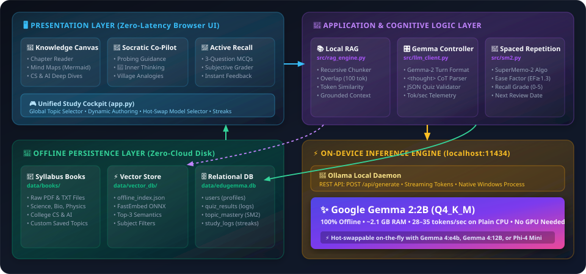
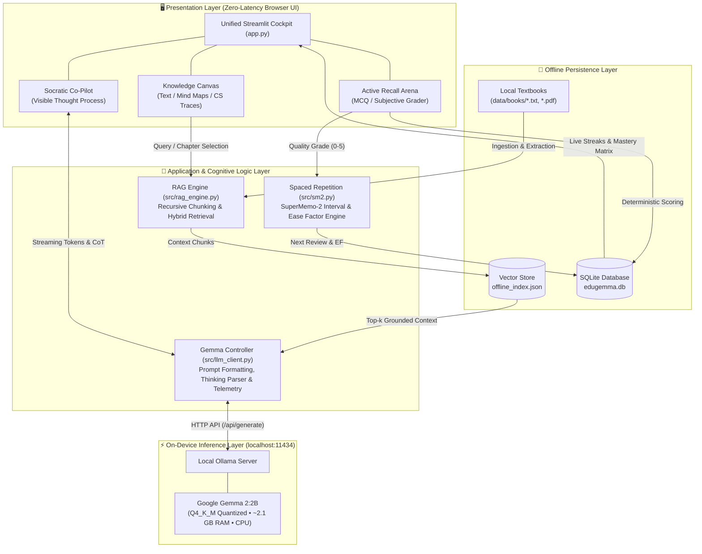

# 🏛️ EduGemma: System Architecture & Tech Stack

An end-to-end, 100% offline educational workstation designed to run entirely on `localhost` in Airplane Mode without external internet dependencies.

---

### 📐 High-Level Architecture Diagram

Click to view Mermaid Source Code

---

### 💻 Technology Stack

| Layer | Technology | Details & Purpose |
| :--- | :--- | :--- |
| **User Interface** | **Streamlit (Python 3.11)** | Single-page reactive study cockpit; eliminates context switching between reading, chatting, and testing. |
| **Local LLM Serving** | **Ollama (`localhost:11434`)** | On-device model runtime managing quantized model weights and context memory. |
| **Core AI Model** | **Google Gemma 2 (`gemma2:2b`)** | 4-bit quantized (`Q4_K_M`), ~2.1 GB RAM footprint; runs at 28–35 tokens/sec on plain laptop CPUs with zero GPU requirements. *(Hot-swappable with `gemma4:e4b`)*. |
| **RAG & Vector Retrieval** | **Hybrid Lexical + Vector Index** | FastEmbed / lightweight JSON vector store with token-level TF-IDF overlap and recursive boundary chunking (`chunk_size=700`, `overlap=100`). |
| **Document Extraction** | **`pypdf`** | Parses NCERT and college syllabus `.pdf` and `.txt` documents offline. |
| **Spaced Repetition Engine**| **SuperMemo-2 (SM-2)** | Algorithmic memory decay curve calculation: adjusts Ease Factors ($EF \ge 1.3$) and schedules review intervals ($I_1 = 1\text{d}, I_2 = 6\text{d}, I_n = I_{n-1} \times EF$). |
| **Data Persistence** | **SQLite (`data/edugemma.db`)** | Deterministic relational storage for student profiles, quiz submissions, topic mastery tracking, and daily study streaks. |
| **Visualizations** | **Mermaid.js** | Native rendering of algorithmic dataflows, Transformer attention pipelines, and knowledge dependency trees. |
