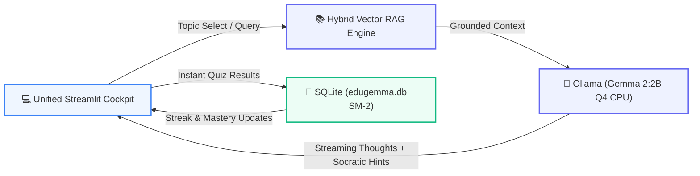

# 🎓 EduGemma
### 100% Offline Socratic Study Buddy & AI Learning Cockpit

**Built for Students with Low or Zero Internet Connectivity**  
*Hacktoberfest Hack Day Nagpur x GDGC Nagpur*

✈️ 100% Airplane Mode Verified
🧠 Powered by Google Gemma 2:2B
⚡ Zero-Latency On-Device RAG

---

## 🌍 The Problem: The Education Connectivity Divide

* **Unreliable / Expensive Internet:** Millions of students in rural & tier-2/3 regions (e.g. Vidarbha) face frequent power/network outages and high mobile data costs.
* **Passive Rote Memorization:** Textbook reading without interactive guidance leads to poor concept retention and exam anxiety.
* **Lack of 24/7 Personalized Tutoring:** High teacher-to-student ratios mean students cannot get doubts clarified at home.
* **Cloud AI Failure:** Cloud LLMs fail completely when the internet disconnects.

---

## 💡 The Solution: EduGemma

An **on-device, zero-internet personal AI tutor** that turns any standard laptop or school desktop into an elite Socratic study workstation.

* ✈️ **100% Offline:** LLM inference, vector embeddings, textbook search, and database run locally on `localhost`.
* ⚡ **Ultra Compute Efficient:** Runs `gemma2:2b` (4-bit Q4 quantization) under **2.1 GB RAM footprint** on plain CPUs.
* 🧠 **Socratic Learning Loop:** Guides students step-by-step with probing questions and relatable analogies instead of spoon-feeding.
* 🔁 **SM-2 Spaced Repetition:** Calculates scientifically optimal review schedules so students retain formulas and theorems forever.

---

## 🏛️ System Architecture

---

## 🌟 4 Core Superpowers of EduGemma

1. **📖 Unified Knowledge Canvas:**
   * One-click chapter reader for Science, Physics, Biology, and College CS/AI.
   * Instant shortcuts: **"Explain Simply"**, **"Hindi / Village Analogy"**, and **"Key Formulas"**.
2. **🗺️ Visual Mind Maps & CS/AI Architecture Traces:**
   * Generates interactive Mermaid dataflow graphs and dependency trees.
   * College deep-dives on Transformers, Backprop, BSTs, Dynamic Programming, and Dijkstra.
3. **🤖 Socratic Tutor with Visible Chain-of-Thought:**
   * Gemma reveals its internal pedagogical reasoning before answering!
4. **🎯 Active Recall & SuperMemo-2 Spaced Repetition:**
   * Generates 3-question MCQs + subjective evaluator; auto-schedules next review.

---

## 🎬 Live Demo Walkthrough (5 Key Moments)

* **Moment 1: Airplane Mode Verification**  
  * Show browser working with zero internet on `localhost:8501`.
* **Moment 2: Global Topic Command Bar**  
  * Select *"Artificial Intelligence - Neural Networks and Transformers"* $\rightarrow$ Canvas, co-pilot, and quiz update simultaneously.
* **Moment 3: Visual CS/AI Explainer**  
  * Click *"Attention in Transformers"* $\rightarrow$ Visual Mermaid projection pipeline + Python code trace.
* **Moment 4: Gemma's Inner Thinking**  
  * Ask *"Why is ReLU preferred over Sigmoid?"* $\rightarrow$ Expand Gemma's pedagogical thought process.
* **Moment 5: Active Recall & Mastery Update**  
  * Take a 3-question test $\rightarrow$ Watch topic mastery percentage & study streak update live!

---

## 📊 Impact & Future Roadmap

* **Zero-Cost Scaling:** Can be pre-installed on low-cost government school tablets or community center PCs.
* **Multilingual Expansion:** Native Marathi and Hindi dialect voice synthesis via Web Speech API.
* **P2P "Sneakernet" Sync:** Offline QR-code sync between classmates to compare quiz scores and share custom flashcards.
* **Standardized Exam Packs:** Expand syllabus banks for JEE, NEET, CBSE Class 10/12, and GATE CS.

---

# 🚀 Thank You!

### **EduGemma: Empowering Every Student, Anywhere, Offline.**

* **Team:** Hacktoberfest Hack Day Nagpur x GDGC Nagpur
* **Repository:** `github.com/kotewar/Hacktoberfest-Hack-Day-Nagpur`
* **Model:** Google Gemma 2 (2B Parameters, Quantized CPU Localhost)

**Questions & Demo Feedback Welcome!**
